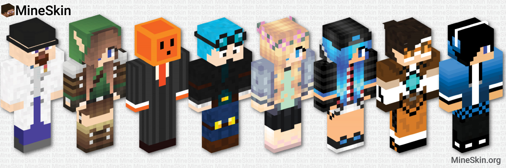

_Orignally posted on [spigotmc.org](https://www.spigotmc.org/threads/tool-api-mineskin-org-custom-skin-skull-generator.164209/)_

This tool allows you to generate valid signed textures for skins or player skulls from regular images.

<!-- truncate -->

I made this thing quite a while ago for some of my plugins. I recently updated the backend and added a website & gallery for it, so I thought I'd share it here :)

[mineskin.org](https://mineskin.org)

There's also a Java API client, to automatically generate the textures:
[InventivetalentDev/MineskinClient](https://github.com/InventivetalentDev/MineskinClient)

It works by logging into one of the donated accounts, uploading the provided image and fetching the signed skin data from Mojang's servers.
Due to the Mojang API request limit, skins can only be changed every ~30 seconds, which is why the uploads are delayed. There are currently 30+ accounts providing the skins, which were donated by various awesome people \<3
If you've got any spare accounts and find this tool useful, please contact me.

I hope some will find this useful! :)
